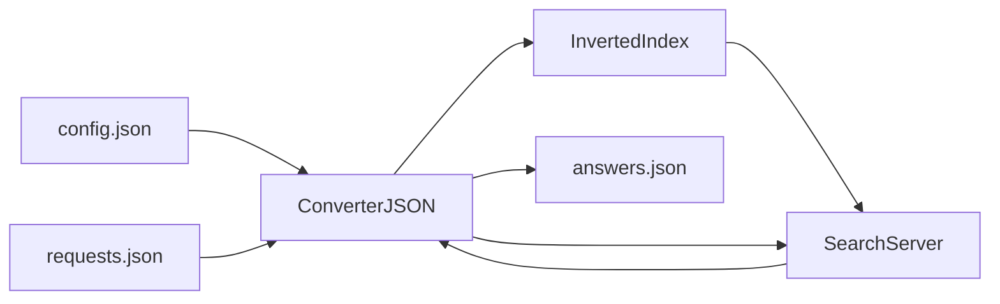

# Search Engine
A training search engine project implemented as part of the "C++ Developer" course.

## Features
- reading JSON configuration
- building an inverted index
- document search
- relevance ranking
- JSON result output

## Search Algorithm
1. Document indexing.
2. Building an inverted index.
3. Parsing the query into unique words.
4. Searching for documents containing all query words.
5. Calculating relevance.
6. Sorting results.

## Technologies
- C++ 17
- CMake
- nlohmann/json
- GoogleTest

## Build 
```bash
cmake -S . -B build
cmake --build build
```

## Run
```bash
./build/search_engine
```

## Run tests
```bash
cd build
ctest
```

## Project Structure
```
search_server
│
├── include/        header files
│   ├── ConverterJSON.h
│   ├── InvertedIndex.h
│   ├── SearchServer.h
│   ├── constantsSearchServer.h
│   └── utilsSearchServer.h
│
├── src/            source files
│   ├── ConverterJSON.cpp
│   ├── InvertedIndex.cpp
│   ├── SearchServer.cpp
│   ├── utilsSearchServer.cpp
│   └── main.cpp
│
├── tests/          GoogleTest tests
│   ├── test_converter_json.cpp
│   ├── test_inverted_index.cpp
│   ├── test_search_server.cpp
│   └── test_utils_search_server.cpp
│
├── resources/      text documents
│   ├── file001.txt
│   ├── file002.txt
│   ├── file003.txt
│   └── file004.txt
│
├── CMakeLists.txt
├── config.json
├── requests.json
└── README.md
```


## Examples of Input and Output JSON Files
Example config.json
```json
{
  "config": {
    "name": "SearchServer",
    "version": "1.0",
    "max_responses": 5
  },
  "files": [
    "resources/file001.txt",
    "resources/file002.txt"
  ]
}
```

Example requests.json
```json
{
  "requests": [
    "milk water",
    "apple"
  ]
}
```

Example answers.json
```json
{
  "answers": {
    "request001": {
      "result": true,
      "relevance": [
        { "docid": 0, "rank": 1.0 },
        { "docid": 1, "rank": 0.5 }
      ]
    },
    "request002": {
      "result": false
    }
  }
}
```

## Architecture

The project consists of several main components:
- **ConverterJSON** - reads configuration and requests from JSON files and writes results.
- **InvertedIndex** - builds an inverted index of documents.
- **SearchServer** - processes search queries and calculates relevance.
- **utilsSearchServer** - helper functions for validating documents and queries.



## Relevance
Document relevance is calculated as:

`rank = count / max_count`
where
- `count` - number of occurrences of query words in the document
- `max_count` - the maximum number of occurrences among all found documents

Results are sorted:
1. by decreasing `rank`
2. if equal, by increasing `doc_id`