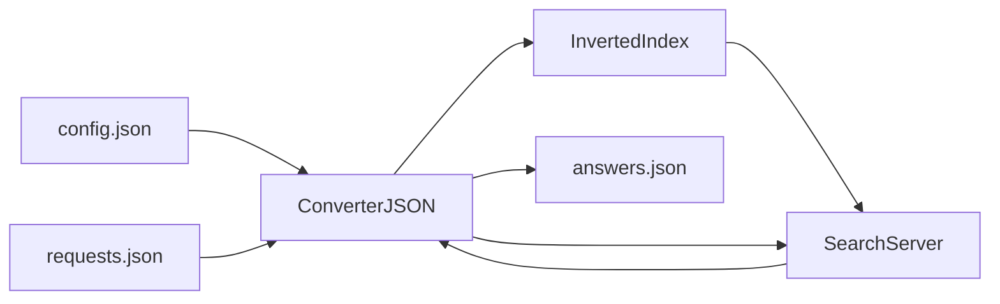

# Search Engine
A simple console search engine written in C++.  
This project was implemented as part of the "C++ Developer" course.

## Features
- reading JSON configuration
- building an inverted index
- document search
- relevance ranking
- JSON result output

## Search Algorithm
1. Document indexing.
2. Building an inverted index.
3. Parsing the query into unique words.
4. Searching for documents containing all query words.
5. Calculating relevance.
6. Sorting results.

## Requirements
- C++17 compatible compiler
- CMake 3.10+

## Technologies
- C++17
- CMake
- nlohmann/json
- Google Test

## Build 
```bash
git clone https://github.com/DimaE001/search_server
cd search_engine
cmake -S . -B build
cmake --build build
```

## Run
```bash
./build/search_engine
```

## Run tests
```bash
cd build
ctest
```

## Project Structure
```
search_server
│
├── include/        header files
│   ├── ConverterJSON.h
│   ├── InvertedIndex.h
│   ├── SearchServer.h
│   ├── constantsSearchServer.h
│   └── utilsSearchServer.h
│
├── src/            source files
│   ├── ConverterJSON.cpp
│   ├── InvertedIndex.cpp
│   ├── SearchServer.cpp
│   ├── utilsSearchServer.cpp
│   └── main.cpp
│
├── tests/          GoogleTest tests
│   ├── test_converter_json.cpp
│   ├── test_inverted_index.cpp
│   ├── test_search_server.cpp
│   └── test_utils_search_server.cpp
│
├── resources/      text documents
│   ├── file001.txt
│   ├── file002.txt
│   ├── file003.txt
│   └── file004.txt
│
├── CMakeLists.txt
├── config.json
├── requests.json
└── README.md
```


## Examples of Input and Output JSON Files
Example `config.json`
```json
{
  "config": {
    "name": "SearchServer",
    "version": "1.0",
    "max_responses": 5
  },
  "files": [
    "resources/file001.txt",
    "resources/file002.txt"
  ]
}
```

Example `requests.json`
```json
{
  "requests": [
    "milk water",
    "apple"
  ]
}
```

Example `answers.json`
```json
{
  "answers": {
    "request001": {
      "result": true,
      "relevance": [
        { "docid": 0, "rank": 1.0 },
        { "docid": 1, "rank": 0.5 }
      ]
    },
    "request002": {
      "result": false
    }
  }
}
```

## Architecture

The project consists of several main components:
- **ConverterJSON** - reads configuration and requests from JSON files and writes results.
- **InvertedIndex** - builds an inverted index of documents.
- **SearchServer** - processes search queries and calculates relevance.
- **utilsSearchServer** - helper functions for validating documents and queries.



## Relevance
Document relevance is calculated as:

rank = count / max_count
where
- `count` - number of occurrences of query words in the document
- `max_count` - the maximum number of occurrences among all found documents

Results are sorted:
1. by decreasing `rank`
2. if equal, by increasing `doc_id`


## How the Search Engine Works

The search engine operates in several stages.

### 1. Loading configuration
At startup the application reads the configuration file `config.json`.  
This file contains:
- search engine name and version
- maximum number of results for a query
- list of documents to be indexed

### 2. Document indexing
All documents listed in `config.json` are loaded and processed.
Each document is split into words and an **inverted index** is created.
The inverted index maps each word to a list of documents in which it appears.

Example:

milk sugar salt
milk milk milk

The index will contain:

milk → (doc0,1) (doc1,3)  
sugar → (doc0,1)  
salt → (doc0,1)

Where:
- `doc_id` is the document identifier
- `count` is the number of occurrences of the word in that document

### 3. Processing search queries
Search queries are read from `requests.json`.

Each query:
1. is split into words
2. normalized
3. duplicate words are removed

Example:
`milk milk water`
becomes
`milk water`

### 4. Finding matching documents
The search engine finds documents that contain **all query words**.

For each word it retrieves the document list from the inverted index and intersects the results.

### 5. Calculating relevance
For each document an **absolute relevance** value is calculated:
`absolute_relevance = sum(count of each query word)`

Then a **relative relevance** is calculated:
`rank = absolute_relevance / max_absolute_relevance`

### 6. Sorting results
Results are sorted by:

1. descending relevance (`rank`)
2. ascending `doc_id` if relevance is equal

### 7. Writing results
The final results are written to `answers.json`.

## Complexity

Indexing complexity: O(N * W)

N - number of documents  
W - average number of words per document