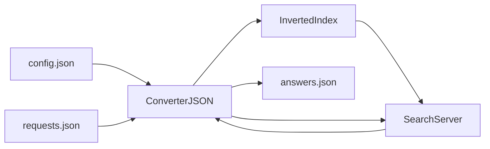

# Search Server
Учебный проект поискового движка, реализованный в рамках курса "Разработчик на C++".

## Возможности
- чтение конфигурации JSON
- построение инвертированного индекса
- поиск документов
- сортировка по релевантности
- вывод результатов JSON

## Алгоритм поиска
1. Индексация документов.
2. Формирование инвертированного индекса.
3. Разбор запроса на уникальные слова.
4. Поиск документов, содержащих все слова запроса.
5. Вычисление релевантности.
6. Сортировка результатов.

## Технологии
- C++ 17
- CMake
- nlohmann/json
- GoogleTest

## Сборка программы 
```bash
cmake -S . -B build
cmake --build build
```

## Запуск программы
```bash
./build/search_engine
```

## Запуск тестов
```bash
cd build
ctest
```

## Структура проекта
```
search_server
│
├── include/        заголовочные файлы
│   ├── ConverterJSON.h
│   ├── InvertedIndex.h
│   ├── SearchServer.h
│   ├── constantsSearchServer.h
│   └── utilsSearchServer.h
│
├── src/            исходный код
│   ├── ConverterJSON.cpp
│   ├── InvertedIndex.cpp
│   ├── SearchServer.cpp
│   ├── utilsSearchServer.cpp
│   └── main.cpp
│
├── tests/          тесты GoogleTest
│   ├── test_converter_json.cpp
│   ├── test_inverted_index.cpp
│   ├── test_search_server.cpp
│   └── test_utils_search_server.cpp
│
├── resources/      текстовые документы
│   ├── file001.txt
│   ├── file002.txt
│   ├── file003.txt
│   └── file004.txt
│
├── CMakeLists.txt
├── config.json
├── requests.json
└── README.md
```


## Примеры входных и выходных файлов JSON
Пример config.json
```json
{
  "config": {
    "name": "SearchServer",
    "version": "1.0",
    "max_responses": 5
  },
  "files": [
    "resources/file001.txt",
    "resources/file002.txt"
  ]
}
```

Пример requests.json
```json
{
  "requests": [
    "milk water",
    "apple"
  ]
}
```

Пример answers.json
```json
{
  "answers": {
    "request001": {
      "result": true,
      "relevance": [
        { "docid": 0, "rank": 1.0 },
        { "docid": 1, "rank": 0.5 }
      ]
    },
    "request002": {
      "result": false
    }
  }
}
```

## Архитектура

Проект состоит из нескольких основных компонентов:
- **ConverterJSON**     чтение конфигурации и запросов из JSON и запись результатов.
- **InvertedIndex**     построение инвертированного индекса документов.
- **SearchServer**      обработка поисковых запросов и вычисление релевантности.
- **utilsSearchServer** вспомогательные функции проверки документов и запросов.



## Релевантность
Релевантность документа вычисляется как

`rank = count / max_count`
где
- `count`     количество вхождений слов запроса в документ
- `max_count` максимальное количество вхождений среди всех найденных документов

Результаты сортируются:
1. по убыванию `rank`
2. при равенстве по возрастанию `doc_id`